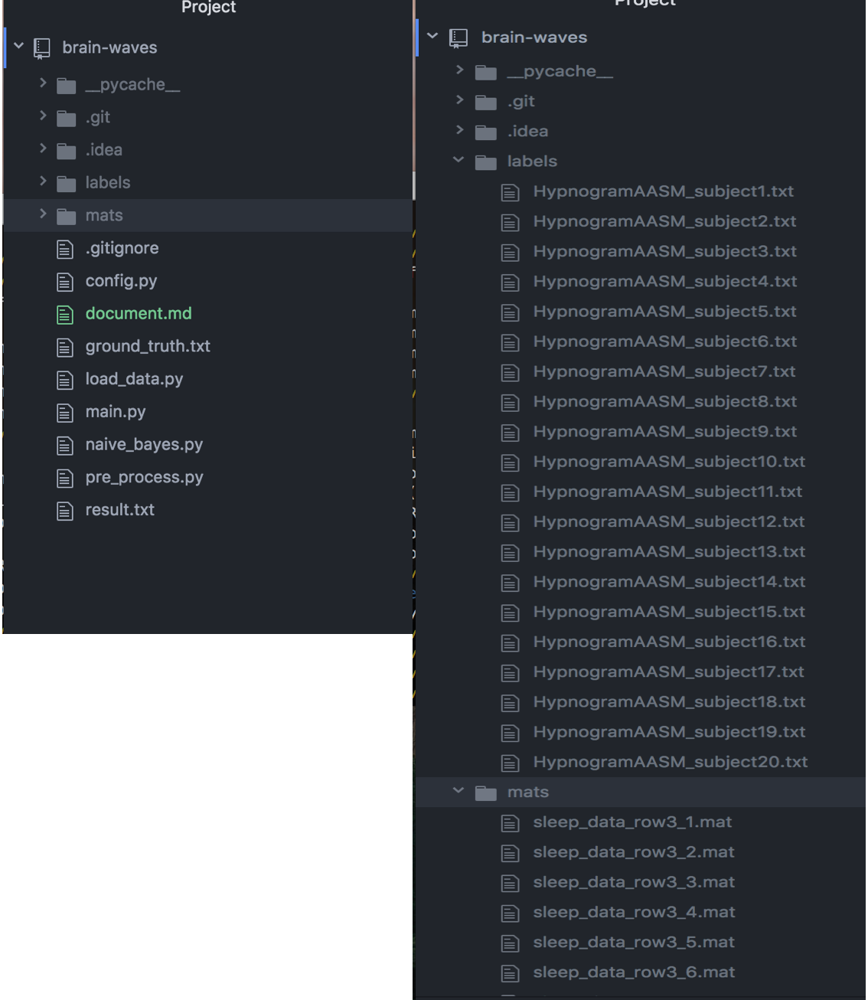
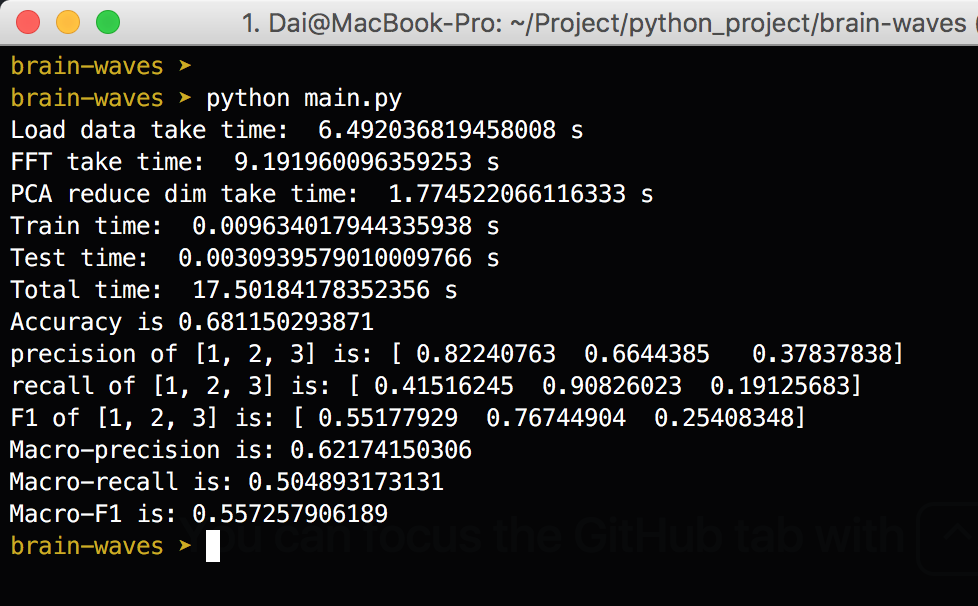

## 脑电波睡眠周期分类（朴素贝叶斯）
###### &ensp; 代东洋 &ensp; 计算机系 &ensp;  2017210885 
### 简介

本次实验使用朴素贝叶斯分类器对脑电波睡眠周期分类。我们主要考虑睡眠的第一阶段、第二阶段和第三阶段（标签分别为1、2和3)。

本次试验中：

+ 预处理阶段，先使用傅立叶变换找到主频（或者前k个振幅最大的频率），然后使用PCA对数据进行降维。

+ 然后使用预处理后的训练数据来训练朴素贝叶斯分类器，再使用贝叶斯分类器预测预处理好的测试数据。

本次实验代码使用Python3。mat文件放在`mats/`文件夹下，标签文件放在`labels/`文件夹下（这个和解压后的文件夹名有一点不一样，解压后文件夹名有乱码，我直接把中文名改成了英文名）。文件目录结构如下图所示：



### 原理

##### 傅立叶变换
使用傅立叶变换可以把时域的数据转换到频域。然后在频域中找到振幅最大的频率，即为主频。

##### PCA降维
本次实验中使用PCA降维。

其主要过程为，先对样本集$X^{'}$（训练集）进行中心化,得到$X$，然后求其协方差矩阵$XX^T$的特征值和特征向量。将特征值进行排序：$\lambda_1 \ge \lambda_2 \ge ... \ge \lambda_d$，取前$d^{'}$个特征值对应的向量$W = (w_1, w_2, ..., w_{d^{'}})$，$W$就是转换矩阵。也可以实现设定好一个阈值t，取满足下面条件的最小$d^{'}$作为降维后的维度。 $$\frac{\Sigma_{i=1}^{d^{'}}\lambda_i}{\Sigma_{i=1}^{d}\lambda_i} \le t$$

本次实验中，实现了这两种方法。`pca_limit_d()`函数指定降维后的维度，`pca_limit_loss`指定阈值t进行降维。

##### 朴素贝叶斯

结合傅立叶变换得到的特征和PCA降维得到的特征，我们可以得到一组新的特征（如果通过傅立叶变换只取主频，使用PCA将数据从1000维降到5维，那么我们得到的新的特征共有 $5+1=6$ 维）。

我们假设数据的各个（新）特征是相互独立的而且符合高斯分布。即:

$$
p(x_i) = \frac{1}{\sqrt{2\pi}\sigma_i} e^{-\frac{(x-\mu_i)^2}{2\sigma_i^2}}
$$

设贝叶斯分类器的预测函数为 $f(\boldsymbol{x}) := \{\boldsymbol{x}\} \rightarrow \{c\}$，则:

$$
f(\boldsymbol{x}) = \underset{c}{\operatorname{argmax}} p(c|\boldsymbol{x})
$$

而
$$
\begin{align*}
p(c|\boldsymbol{x})  &\propto p(c) \prod_i{ p(x_i)} \\
p(c|\boldsymbol{x})  &\propto p(c) \prod_i{\frac{1}{\sqrt{2\pi}\sigma_i} e^{-\frac{(x-\mu_i)^2}{2\sigma_i^2}}}  \\
p(c|\boldsymbol{x})  &\propto p(c) \prod_i{\frac{1}{\sigma_i} e^{-\frac{(x-\mu_i)^2}{2\sigma_i^2}}}  \\
\end{align*}
$$

所以：

$$
f(\boldsymbol{x}) = \underset{c}{\operatorname{argmax}}p(c) \prod_i{\frac{1}{\sigma_i} e^{-\frac{(x-\mu_i)^2}{2\sigma_i^2}}}
$$

而实际应用中，当特征数量比较多时，计算 $\prod_i{\frac{1}{\sigma_i} e^{-\frac{(x-\mu_i)^2}{2\sigma_i^2}}}$ 常常会造成下溢，因此我们对 $p(c) \prod_i{\frac{1}{\sigma_i} e^{-\frac{(x-\mu_i)^2}{2\sigma_i^2}}}$ 取对数。得到：

$$
\begin{align*}
f(\boldsymbol{x}) &= \underset{c}{\operatorname{argmax}} log( p(c) \prod_i{\frac{1}{\sigma_i} e^{-\frac{(x-\mu_i)^2}{2\sigma_i^2}}}) \\
f(\boldsymbol{x}) &= \underset{c}{\operatorname{argmax}} log(p(c)) - \sum_i{log(\sigma_i)} - \sum_i{\frac{(x-\mu_i)^2}{2\sigma_i^2}}
\end{align*}
$$

代码实现时，即根据上面的公式（取对数防止下溢）预测测试样本的类别。

### 代码

##### 代码简介

代码由`config.py`、`load_data.py`、`pre_process.py`、`naive_bayes.py`和`main.py`。

+ `config.py`为配置文件，通过改变`config.py`中的相关变量的值，可以更改数据文件的路径、降维后的维度、通过傅立叶变换得到的特征数量等。

+ `load.py`文件主要负责加载数据。

+ `pre_pocess.py`文件主要负责预处理数据。包括PCA降维和傅立叶变换。

+ `naive_bayes.py`文件是朴素贝叶斯分类器的实现。

+ `main.py`文件为程序的入口，执行指令`python main.py`即可运行程序。

##### 关键代码介绍

+ `train_single(subset)`函数用来训练类条件概率的参数（高斯分布的均值和方差）。其输入`subset`为训练集的子集，某一类的所有的训练样本。输出为两个数组，其中`mu[i]`表示第i个特征的均值，`sigma[i]`代表第i个特征的标准差。均值和标准差按照最大似然估计进行估计。

```python
def train_single(subset):
    """
    get parameters of class-conditional probability
    :param subset: subset of training set, all the instances in the subset have
     		the same label(in the same class)
    :return:
        mu: an array, the ith element means the expectation of the ith feature
        	 (by Maximum likelihood estimation)
        sigma: an array, the ith element means the standard deviation of the 
        	ith feature (Maximum likelihood estimation)
    """
    n, _ = subset.shape
    mu = np.average(subset, axis=0)
    diff_sq = (subset - mu) ** 2
    sigma = np.sqrt(np.sum(diff_sq, axis=0) / n)
    return mu, sigma
```

+ `naive_bayes_predict(samples, c_list, mu_m, sigma_m, c_probs)`函数用于预测脑电波数据的分类。返回值为测试集的预测值（数据类型为数组）。`naive_bayes_predict()`函数按照公式 $f(\boldsymbol{x}) = \underset{c}{\operatorname{argmax}} log(p(c)) - \sum_i{log(\sigma_i)} - \sum_i{\frac{(x-\mu_i)^2}{2\sigma_i^2}}$ 预测脑电波数据的分类。关于输入参数：

	+ `samples`代表测试集数据。
	+ `c_list`代表所有的类别。
	+ `mu_m`是一个矩阵，其中`mu_m[i,j]`代表第i个类的类条件概率的第j个特征的均值。
	+ `sigma_m`是一个矩阵，其中`sigma_m[i,j]`代表第i个类的类条件概率的第j个特征的标准差。
	+ `c_probs`代表先验概率。

```python
def naive_bayes_predict(samples, c_list, mu_m, sigma_m, c_probs):
    """
    predict the labels of test set
    :param samples: test set, m * n matrix which means m instances and every
    	 instance has n features
    :param c_list: all the classes which is arranged in a list
    :param mu_m: k * n matrix, k = len(c_list).
        mu_m[i][j] means the jth feature's expectation of c_list[i]'s class-conditional 
        probability.
    :param sigma_m: k * n matrix, k = len(c_list).
        sigma_m[i][j] means the jth feature's standard deviation of c_list[i]'s
         class-conditional probability
    :param c_probs: Priori probability, have the same size with c_list
    :return: an array with m elements(results), the predict results of test set. 
    	results[i] is the predict value of samples[i,:]
    """
    p_lists = list()
    rows, _ = samples.shape
    for i in range(len(c_list)):
        exp = np.sum((samples - mu_m[i]) ** 2 / (2 * sigma_m[i] ** 2), axis=1)
        sum_log_sigma = np.sum(np.log(sigma_m[i]))
        p = np.log(c_probs[i]) - sum_log_sigma - exp
        p_lists.append(list(p))
    p_matrix = np.array(p_lists)
    idx_r = np.argmax(p_matrix, axis=0)
    c_matrix = np.array(c_list).repeat(rows).reshape(len(c_list), -1).transpose()
    results = c_matrix[range(rows), idx_r]
    return results
```

### 实验

实验环境：操作系统 MacOS，内存16G， CPU为“2.5 GHz Intel Core i7”

本次试验中，选择前19人的数据作为训练集，选择第20个人的数据作为测试集。（如果更改训练集和测试集只需改变`config.py`中的变量`train_numbers`和变量`test_numbers`的值即可），把预测结果保存在`result.txt`文件中（如果想更改输出的文件名，只需更改`config.py`中的变量`result_file`的值即可）。

由于本次试验中只考虑了睡眠的第一阶段、第二阶段和第三阶段，因此对测试数据也进行了筛选，并因此打乱了测试集原来样本的顺序，这种情况下，`labels/HypnogramAASM_subject20.txt`文件中的值并不是 Ground Truth。为了分析预测结果，把Ground Truth保存在`ground_truth.txt`文件中。（如果选择不筛选测试样本，只需将`config.py`中的`is_filter_test`变量设为`False`即可，如果选择想要更改Ground Truth所保存的文件名，只需更改`config.py`中变量`gt_file`的值即可）。

另外，`config.py`中变量`d`的值代表PCA降维后的维度，`config.py`中变量`freq_k`的值代表傅立叶变换后获取的特征的个数。本次试验中，`d`取5，`freq_k`取1。

在项目文件夹下，输入指令`python mian.py`,程序运行结果如下：





可以看出：

+ 预测的正确率为0.681。
+ 1、2、3类的准确率分别为0.822、0.664、0.378
+ 1、2、3类的召回率分别为0.415、0.908、0.191

